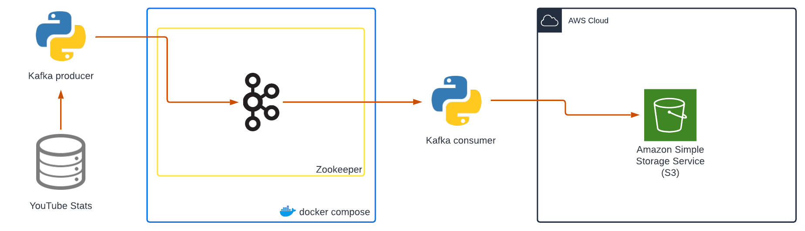
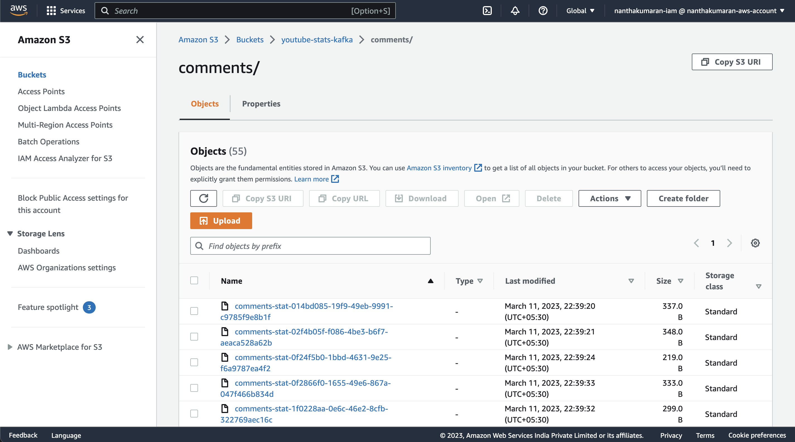

# Realtime YouTube Stats using Python and Kafka

> NOTE: For simplicity I'm using csv files from Kaggle

## Architecture



## To run

First start the containers in a terminal

```sh
$ pip3 install -r requirements.txt

$ docker compose up
```

Then, run the following command in a separate terminal

```sh
$ bash consume.sh -t <topic>
```

The topics are `comments` and `video-stats`. Then in a separate terminal, run the following command

```sh
$ bash produce.sh -t <topic>
```

## Mics

To have this working fine we need to have a s3 bucket. Once after consumer uploads the file from the kafka broker,


